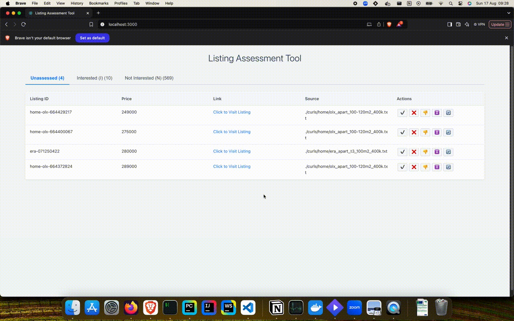
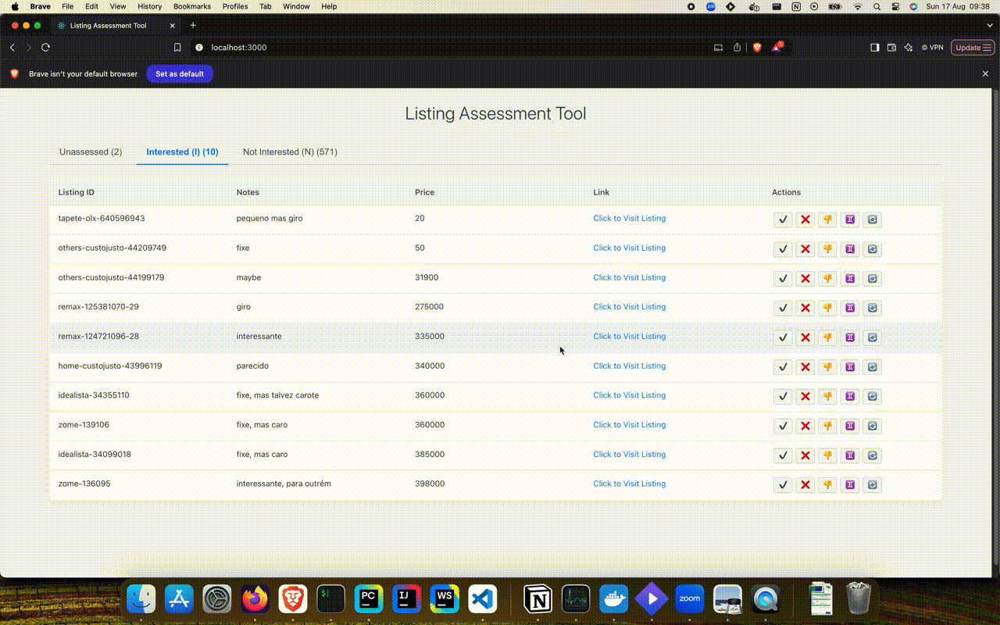

# Home Seeker

Tired of juggling browser tabs and spreadsheets to track interesting listings across multiple websites? Home Seeker automates the discovery process, consolidates listings into a single interface, and provides a powerful workflow to assess them, ensuring you never lose track of a potential deal.

An application to find, fetch, and assess online listings. Originally built for real estate, but designed to be extensible for other categories.

## The Workflow

The project operates in two main phases:

1.  **Data Fetching (The `fetcher` service):** A containerized set of shell scripts executes `curl` requests that you provide. It scrapes the resulting data and saves new or updated listings to a MySQL database.
2.  **Assessment (The `frontend` service):** A web application reads from the database and provides a simple UI to let you review the fetched listings, marking them as "interesting" or "not interesting".

---

## How to Use - **Data Fetching**

### Step 1: Initial Setup

First, start the core services (Database, Backend, Frontend). From the project's root directory, run:

``` shell
docker compose up -d db backend frontend
```

### Step 2: Add Your Searches

The power of this tool comes from the searches you want it to perform.

1. Get the cURL command:
   * In your web browser, open the Developer Tools (usually F12) and go to the "Network" tab.
   * Perform the search you want on a supported website (e.g., a search for T2 apartments in Lisbon on Idealista).
   * Find the network request that fetches the search results.
     * Review the [network request for supported sources](./supported-sources-network-request.md).
   * Right-click on it and select Copy > Copy as cURL (bash).
2. Save the cURL command:
   * Create a new .txt file inside the fetcher-scripts/curls/ directory. The directories are organized by category (i.e. home, items)
   * Paste the copied curl command into this file.
   * Example path: fetcher-scripts/curls/home/idealista_t2_lisbon.txt

   
### Step 3: Run the Fetcher

To execute the fetching scripts, run the fetcher service on its own:

``` shell
docker compose up fetcher
```

---
## How to Use - **Assessment**

Once you have fetched some listings, you can begin the assessment process using the web interface.

1.  In your browser, navigate to `http://localhost:3000`.
2.  You will land on the main **Unassessed Listings** tab.

### The Unassessed Listings Tab

This is the default view, showing all the listings that the `fetcher` has found, but you haven't reviewed yet.

Each listing shows:
* its source (e.g., Idealista, Remax),
* the listed price, and
* a direct link to view the listing on its original website.

### Taking Action on a Listing

For each listing, you have several options:

*   **Approve (Mark as Interested):** Click this to move the listing to the "Interested" tab. A text box will appear, allowing you to add a note or justification for why you're interested.
*   **Reject (Mark as Not Interested):** This moves the listing to the "Not Interested" tab. A text box will appear for you to add a justification (e.g., "bad location," "overpriced").
*   **Discard:** This is a quick way to mark a listing as "not interested" *without* needing to provide a justification. It will also be moved to the "Not Interested" tab.
*   **Identify as Duplicate:** Click this to mark the listing as a duplicate. It will be moved to the "Not Interested" tab.
*   **Reassess:** This button allows you to undo an assessment. If you click it on a listing in the "Interested" or "Not Interested" tabs, the listing will be moved back to the main "Unassessed" tab. (Note: Clicking this on an already unassessed listing has no effect).



### Reviewing Your Assessments

There are two additional tabs to help you review your choices:

*   **Interested Tab:** Contains all the listings you have approved. You can see the price, link, and the justification you provided for each one.
*   **Not Interested Tab:** Contains all listings you have marked as not interested, discarded, or identified as a duplicate. The justifications are also visible here.



Currently, there are no filtering or sorting options within these two tabs.

## Contributing: Adding a New Scraper

The system is designed to be easily extended. If you wish to add a scraper for a new source, follow these steps:

* Open a pull-request with the following criteria:
  1.  **Create the Script:** In the `fetcher-scripts/` directory, create a new script named `get_<new_source>_curl_data.sh`. Use the existing scripts as a template for parsing the HTML/JSON response and calling the database handler.
  2.  **Use the Database Handler:** Your script should source and use `db_handler.sh` to interact with the database, specifically the `upsert_listing` function.
  3.  **Update the Orchestrator:** Add a call to your new script within `get_all_curl_data.sh`.
  4.  **Document:** Add the new source to the "Supported Sources" list in this README.