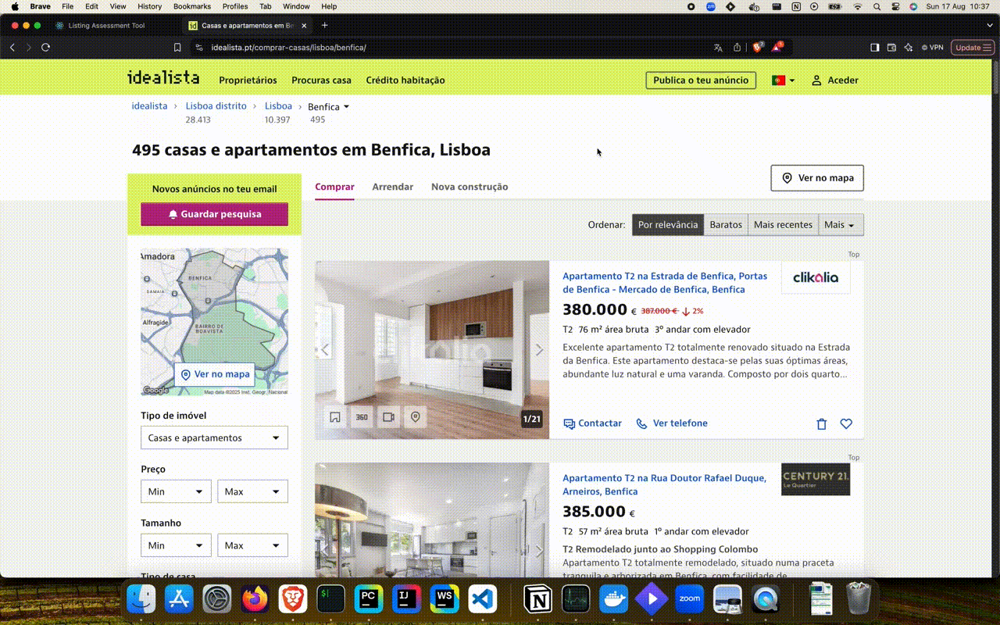
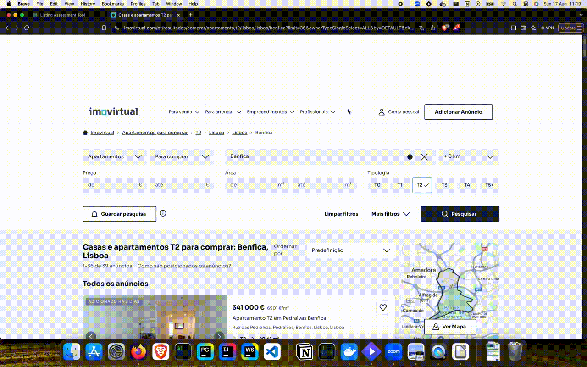
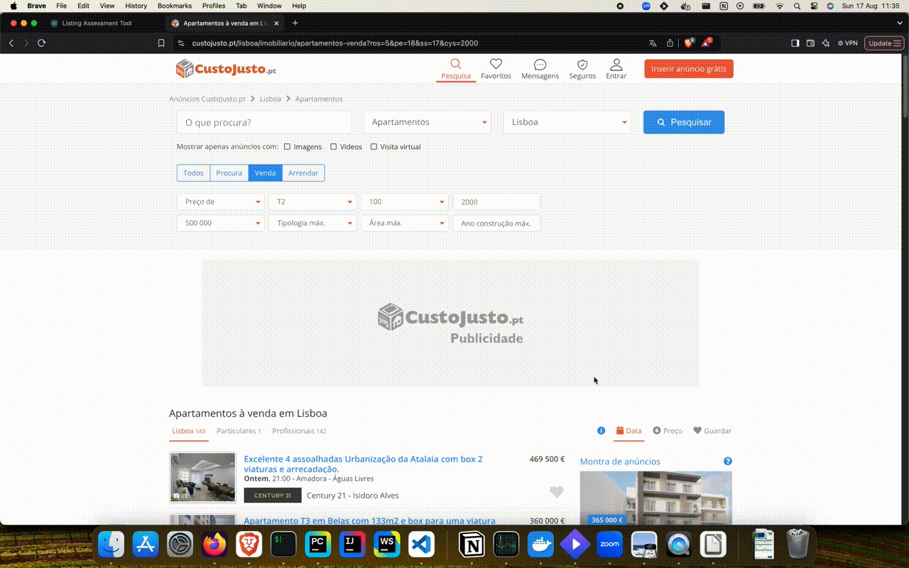
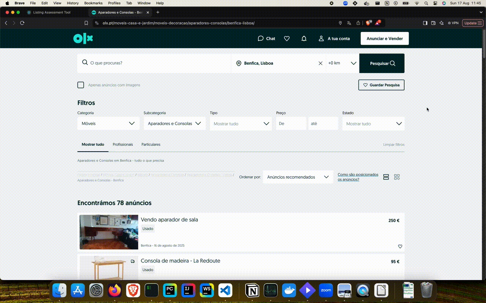

# Supported Sources Network Requests

The fetcher is designed to parse data from the following websites (supported sources).

Each supported source has a textual explanation for finding the corresponding request should be copied, and a demonstrative video for finding and saving.

## Home

### ERA

* The request type is **Fetch/XHR**.
* The request is named _"**Search**"_.

### Remax

* The request type is **Fetch/XHR**.
* The request is named _"**PaginatedMultiMatchSearch**"_ or _"**PaginatedMultiMatchSearchWithGeoHash**"_.

### Zome

* The request type is **Fetch/XHR**.
* The request is named _"**get_angariacoes**"_.

### Idealista

* The request type is **HTML/Doc**.
* The request should be the only one in the **Doc** tab.

### Imovirtual

* The request type is **HTML/Doc**.
* The request should be the only one in the **Doc** tab.

### CustoJusto (Home)

* The request type is **HTML/Doc**.
* The request should be the only one in the **Doc** tab.

## Items:

### OLX

* The request type is **HTML/Doc**.
* The request should be the only one in the **Doc** tab.

### CustoJusto (Items)

For items, obtaining the search request should be exactly the same as for the [Home](#custojusto-home) section

* The request type is **HTML/Doc**.
* The request should be the only one in the **Doc** tab.

